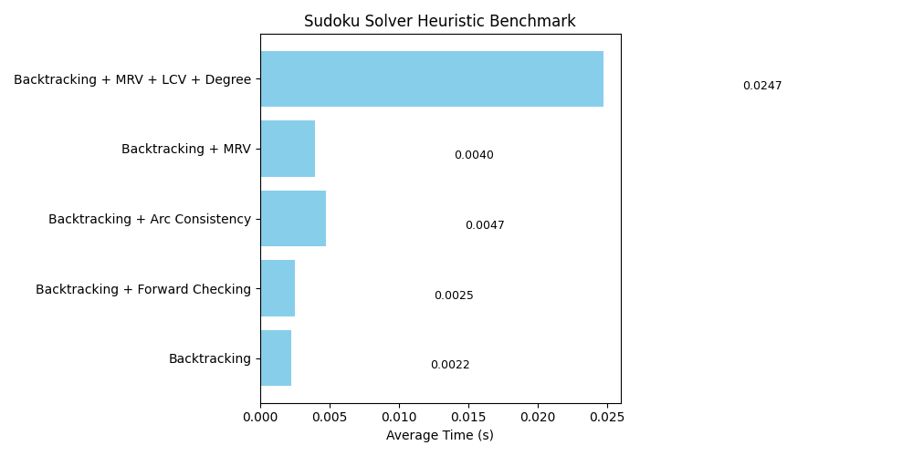

# 🧠 Sudoku Solver Benchmark Report

This report compares the performance of different CSP techniques used to solve randomly generated Sudoku puzzles.

## 🔍 Comparison Table

| Technique | Average Time (s) |
|-----------|------------------|
| Backtracking | 0.0022 |
| Backtracking + Forward Checking | 0.0025 |
| Backtracking + Arc Consistency | 0.0047 |
| Backtracking + MRV | 0.0040 |
| Backtracking + MRV + LCV + Degree | 0.0247 |

## 📊 Visualization

---
🕒 Each average time is based on 10 randomly generated puzzles.
